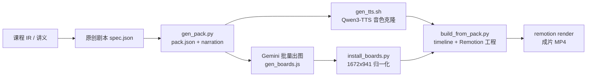

# Gemini 黑板风课程视频管线

用 **Gemini 概念板图 + 克隆 TTS 旁白 + Remotion 渲染** 批量生产「黑板手绘风」讲解视频（16:9，1920×1080，每讲约 2.5 分钟）。已在 CS106A 系列 27 讲上量产验证（覆盖课程全部讲座），单讲生产耗时约 8 分钟（不含渲染）。

## 管线



- **布局板图 ×5**（开场/承接/陷阱/例子/结尾）：全系列复用，一次生成
- **概念板图 ×3**（每讲核心概念）：每讲独立出图，prompt 走固定构图模板
- **槽位文字**：粉笔字由 Remotion 渲染（不依赖图片），stages 渐显
- **旁白**：Qwen3-TTS（mlx-audio，Apple Silicon MLX 加速）克隆真人音色

## 目录

| 路径 | 内容 |
|---|---|
| `scripts/gen_pack.py` | 紧凑 spec → pack.json + narration/all.json（8 场 26 槽位模板） |
| `scripts/gen_boards.js` | Gemini 浏览器 tab 批量出图（CDP，防重复、防假完成） |
| `scripts/install_boards.py` | ffmpeg 归一化板图 + 回写 pack.json |
| `scripts/build_from_pack.py` | pack.json → timeline.json + Remotion series 入口 |
| `scripts/qa_slots.py` | 逐槽位粉笔字质检 |
| `scripts/gen_tts.sh` | Qwen3-TTS 音色克隆批量合成 |
| `remotion/src/` | Lesson 渲染核心（SlotView / types） |
| `remotion/public/boards/` | 8 张共享布局板图 + 3 张示例概念板图 |
| `templates/board-prompts.md` | 全部出图 prompt 模板 |
| `example/` | 一讲完整 pack 示例 |
| `METHODOLOGY.md` | 完整方法论 |

## 快速开始

```bash
# 1. 安装 Remotion 依赖
cd remotion && npm install

# 2. 写一讲的剧本 spec（参照 example/spec.json 字段说明）
python3 scripts/gen_pack.py my_lecture/spec.json

# 3. 合成旁白（需先准备音色参考与 TTS 工具链，见脚本头注释）
scripts/gen_tts.sh my_lecture

# 4. Gemini 出概念板图（浏览器需登录 gemini.google.com，见 LESSONS-LEARNED.md）
#    写 /tmp/boards_job.json 后执行 scripts/gen_boards.js（omp eval 内 %load）
python3 scripts/install_boards.py my_lecture /tmp/my_c1.png /tmp/my_c2.png /tmp/my_c3.png

# 5. 装配并渲染
./tts/venv/bin/python scripts/build_from_pack.py my_lecture my_lecture/pack.json
cd remotion && npx remotion render src/series/my_lecture.tsx my-lectureCourse out/my_lecture.mp4 --codec=h264
```

## 质检红线

- 每段旁白 8–40 秒（超 40s TTS 易失控，删段重跑）
- 成片 `silencedetect` 无 >1.2s 断轨
- 概念板图零文字（AI 图里出现文字/笔画一律重出）
- 逐帧抽检 stages 渐显与粉笔字渲染

详见 `LESSONS-LEARNED.md` 与 `METHODOLOGY.md`。
